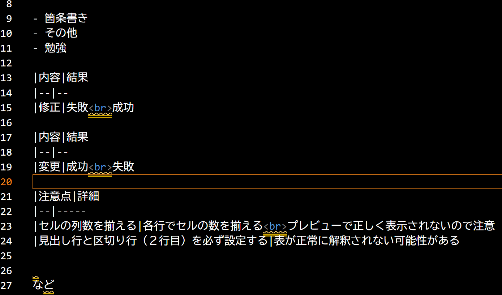

# この文書はテスト形式です

## **この文章を強調したい**

## GitHubのファイル

このテキストを編集しました。あたらしく文章を追加しました。

- 箇条書き
- その他
- 勉強

|内容|結果
|--|--
|修正|失敗 成功

|内容|結果
|--|--
|変更|成功 失敗 中止

|注意点|詳細
|--|-----
|セルの列数を揃える|各行でセルの数を揃える プレビューで正しく表示されないので注意
|見出し行と区切り行（２行目）を必ず設定する|表が正常に解釈されない可能性がある

など

## 画像の貼り付け

変更をコミットするときは、コミットにファイルの追加が含まれる
